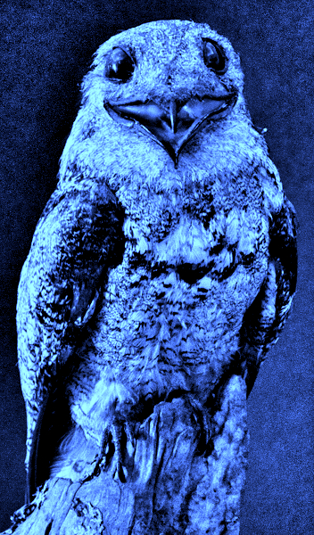

# Urutau

<i>Urutau é uma biblioteca que implementa o alya design system, com foco na criação de componentes
e módulos de uso geral.</i>

os componentes são divididos da seguinte forme:

<ul>
  <li>Componentes de produtos: TAG = urt-product-<b>[NOME DO COMPONENTE]</b></li>
  <li>Componentes puros: TAG = urt-<b>[NOME DO COMPONENTE]</b></li>
  <li>Módulos: os módulos são usados nos componentes e podem ser integrados nos projetos, os módulos possuem 
responsabilidades secundárias como por exemplo: Tradução, consumo de recursos HTTP, Eventos e Etc.
</ul>

os componentes de produto são componentes maiores, que necessitam da colaboração de componentes puros
e agregam lógica interna, com base na companhia não sendo aceitavél a inclusão de lógica especifica de produto.

## Recommended Setup
- [VS Code](https://code.visualstudio.com/) + [Vue - Official](https://marketplace.visualstudio.com/items?itemName=Vue.volar) (previously Volar) and disable Vetur
- Use [vue-tsc](https://github.com/vuejs/language-tools/tree/master/packages/tsc) for performing the same type checking from the command line, or for generating d.ts files for SFCs.

 

